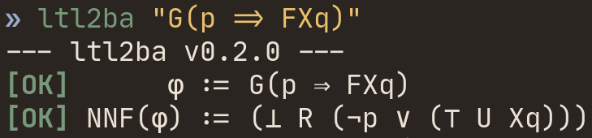

## Introduction

L'objectif de ce devoir est d'implémenter l'algorithme[^1] permettant de
compiler une formule LTL en un automate de Büchi généralisé sur les transitions
équivalent.
Le projet prends donc la forme d'un compilateur permettant dans un premier
temps de [parser](#parsing) une formule LTL et dans un second temps de
[générer](#génération) l'automate de Büchi équivalent -- voir la Figure 1.

{height=30%}

## Architecture

> _Le code source du projet est disponible dans le dépôt GitHub
[`ltl2ba`](https://github.com/EmileRolley/ltl2ba)[^2]._

Le programme est implémenté en OCaml, en effet, ce langage est tout
particulièrement efficace pour l'implémentation de compilateurs ou
d'analyseurs.

Les sources sont divisées en trois parties (répertoires) :

- `src/` contient le point d'entrée du programme ainsi que le module `Cli`,
- `src/core/` contient l'ensemble des structures de données et fonctions
	utilisées pour l'implémentation de l'algorithme,
- `src/parsing` contient l'implémentation du parser et du lexer.

### Parsing

Le parser de formule LTL est implémenté avec `ocamllex` et `menhir`.
Il permet de reconnaitre la grammaire décrite dans la \autoref{fig:grammar}.
Par exemple, la formule LTL $\text{G}((p \vee q) \Rightarrow \neg p)$ devra
s'écrire $\text{G}((p \; | \; q) => !p)$.

\begin{figure}
\begin{align*}
\varphi ::=& \; &\text{\small formule LTL}\\
        &| \; \term{false} \; | \; \term{true} &\text{\small booléens}\\
        &| \; \rho    	                    &\text{\small proposition atomique}\\
        &| \; \circledcirc \varphi    	                &\text{\small opérateur unaire}\\
        &| \; \varphi \circledast \varphi    	        &\text{\small opérateur binaire}\\
        &| \; \term{(} \varphi \term{)}    	        &\text{\small formule parenthésée}\\\\
\circledcirc ::=& \; \term{!} &\text{\small négation booléenne}\\
&| \; \term{X} &\text{\small opérateur temporel \textit{Next}}\\
&| \; \term{F} &\text{\small opérateur temporel \textit{Finally}}\\
&| \; \term{G} &\text{\small opérateur temporel \textit{Globally}}\\\\
\circledast ::=& \; \term{|} &\text{\small disjonction booléenne}\\
&| \; \term{\&} &\text{\small conjonction booléenne}\\
&| \; \term{=>} &\text{\small implication booléenne}\\
&| \; \term{U} &\text{\small opérateur temporel \textit{Until}}\\
&| \; \term{R} &\text{\small opérateur temporel \textit{Release}}\\\\
\rho ::=& \; [a-z][a-zA-Z0-9]^{*}
\end{align*}
\caption{Grammaire des formules LTL reconnaissables.}
\label{fig:grammar}
\end{figure}

### Génération

> _La documentation des modules utilisés pour l'implémentation de l'algorithme est
> disponible [ici](https://emilerolley.github.io/ltl2ba/ltl2ba/Core/index.html)[^3]._

Après la phase de parsing vient celle de la construction de l'automate.

Pour cela j'ai utilisé le module
[`ocamlgraph`](https://ocaml.org/p/ocamlgraph/2.0.0) et ai défini l'automate de
Büchi généralisé sur les transitions comme un graphe orienté et étiqueté
([`Core.Automata.TransBuchi`](https://emilerolley.github.io/ltl2ba/ltl2ba/Core/Automata/TransBuchi/index.html))
dans lequel un nœud représente un état et est étiqueté par son ensemble de formules
([`Core.Automata.FormulaSet.t`](https://emilerolley.github.io/ltl2ba/ltl2ba/Core/Automata/index.html#module-FormulaSet)),
; les transitions sont des arcs étiquetés par l'ensemble de propositions
atomiques $\Sigma_p$ correspondant, de plus, s'il fait parti d'une condition
d'acceptation elle est également étiquetée par les formules LTL
correspondantes.
Le graphe peut être sauvegardé au format Dot grâce au module
[`Core.Automata.TransBuchiDotPrinter`](https://emilerolley.github.io/ltl2ba/ltl2ba/Core/Automata/TransBuchiDotPrinter/index.html).

En ce qui concerne l'implémentation de l'algorithme, j'ai fait le choix de ne
pas construire de graphe intermédiaire pour chaque état.
La fonction `Core.Algorithm.red {phi}` calcule donc à la fois les états accessible
depuis `phi` sans utiliser de transitions marquées et pour chaque $\alpha$,
l'ensemble des états accessibles en empruntant uniquement des transitions
marquées par $\alpha$.
Ces états son stockées dans la structure de données
[`Core.Algorithm.red_states`](https://emilerolley.github.io/ltl2ba/ltl2ba/Core/Algorithm/index.html#type-red_states).

Finalement, les états et transitions de l'instance du `TransBuchi` sont ajoutés
_à la volée_ (dans le fichier `src/ltl2ba.ml`) en appliquant récursivement
`Core.Algorithm.red` sur l'ensemble des états générés.

## Fonctionnalités

Dans sa dernière version,
[`ltl2ba.0.2.0`](https://github.com/EmileRolley/ltl2ba/releases/tag/v0.2.0) est
capable de parser n'importe qu'elle formule LTL respectant la grammaire décrite
dans la \autoref{fig:grammar}. Pour cela, après avoir compilé l'exécutable en
suivant les instructions décrites dans le
[`README`](https://github.com/EmileRolley/ltl2ba#build), il suffit de spécifier
en argument la formule LTL à parser -- voir la Figure 3.

{width=60%}

Afin de sauvegarder l'automate généré au format dot, il suffit de préciser le
chemin vers le fichier souhaité grâce à l'option `-d` -- voir la Figure 4 et 5.

{width=70%}

{width=70%}

L'état initial de l'automate est rectangulaire et les transitions acceptantes
sont en pointillées et coloriées avec une couleur associée à la formule LTL de
la condition d'acceptation correspondante. Lorsqu'une transition appartient à
plusieurs conditions d'acceptations alors est coloriée avec la moyenne des
couleurs de chacune des conditions -- voir la Figure 6.

{height=40%}

\newpage

Il également possible d'afficher plus d'information lors de l'exécution en précisant
l'option `-v` -- voir la Figure 7.

{width=78%}

\newpage

## Conclusion

Avoir fait le choix de ne pas construire le graphe intermédiaire à engendré de
nombreuses difficultés, notamment sur la gestion des conditions acceptantes, et
à forcer l'usage de structure de données et étapes de calculs supplémentaires
complexifiant le code pour un gain de performance non mesuré. Je pense qu'il
serait intéressant d'avoir une implémentation vraiment fidèle à l'algorithme
afin de comparer si un gain de performance est observable, ainsi que de
comparer la compréhension du code.

Malgré cela, j'ai réussi à implémenté une version fonctionnelle. De plus, j'ai
beaucoup appris sur la gestion de projet en OCaml, en effet, j'ai pu mettre en
place de l'intégration continue avec GitHub : exécution automatique des tests
unitaires et de leurs couvertures, ainsi que la mise en ligne de la
documentation -- pour la quelle j'ai porté une attention toute particulière.

[^1]: L'algorithme est décrit dans les notes du cours d'_Introduction à la
  vérification_ de Marc Zeitoun, et est retranscrit dans la documentation du
  programme : \url{https://emilerolley.github.io/ltl2ba/ltl2ba/index.html\#algo}

[^2]: Adresse du dépôt : \url{https://github.com/EmileRolley/ltl2ba}

[^3]: La documentation est disponible à l'adresse suivante :
  \url{https://emilerolley.github.io/ltl2ba/index.html}
