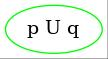
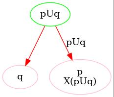
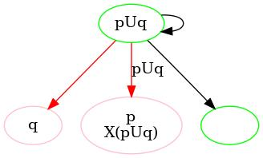
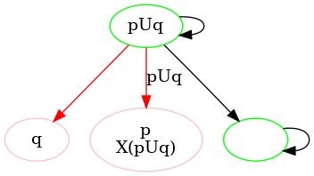
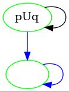

## Automates de Büchi sur _les transitions_

. . .

Même définition que pour un automate de Büchi généralisé :

\begin{center}
  $\mathcal{A} = (S, \rightarrow, S_0, F_1, ..., F_l)$
  \; avec \;
  $\forall i \in \{1, ..,  l\}, \; F_i \subseteq \; \rightarrow$
\end{center}

. . .

\begin{figure}[ht]
    \centering
    \begin{tikzpicture}[auto, on grid, every node]
        \node[state, initial] (x1) at (0, 0) {1};
        \node[state] (x2) at (2, 0) {2};
        \path (x1) edge [loop above] node{$\Sigma$} (x1);
        \path[dashed, thick] (x1) edge [bend left] node{$\ap{p}$} (x2);
        \path[dashed, thick] (x2) edge [loop above] node{$\ap{p}$} (x2);
        \path (x2) edge [bend left] node{$\Sigma$} (x1);
    \end{tikzpicture}
    \caption{Exemple d'automate reconnaissant la formule LTL $\op{GF}\ap{p}$, avec
   en pointillé, les transitions appartenant à l'unique condition d'acceptation.}
\end{figure}

## L'algorithme de traduction

### Intuition

Diviser la formule de départ $\varphi$ en sous-formules plus simple (dites
_réduites_) et ajouter une condition d'acceptation pour chaque sous-formule de
la forme $\alpha \op{U} \beta$.

. . .

### Étapes

1. Mise en forme normale négative de $\varphi$.
2. $S_0 = \{ \varphi \}$.
3. Pour chaque état Y dans $S$ :
    - Calculer un graphe orienté temporaire G.
    - Ajouter dans $\mathcal{A}$ les transitions et les nouveaux états
      correspondants grâce à G.
4. Déterminer les transitions appartenant aux conditions d'acceptations.

## L'algorithme de traduction

. . .

### Définition (_NNF_)

Une formule est en **forme normale négative** (_NNF_) si elle est constituée
uniquement des sous-formules suivantes :

- $\bot, \ap{p}$ et $\neg \ap{p}$ avec $\ap{p} \in$ AP
- $\op{X}\alpha$ et $\alpha \circledast \beta$ avec $\circledast \in \{\op{U, R, \vee, \wedge}\}$

. . .

### Définition (_ensemble réduit_)

Un ensemble de formules Z est **réduit** si :

- les formules de Z sont de la forme $\ap{p}$ et $\neg \ap{p}$ avec $\ap{p} \in$ AP
- $\bot \notin$ Z, et $\{\ap{p}, \neg \ap{p}\} \nsubseteq$ Z pour tout $\ap{p} \in$ AP.

## L'algorithme de traduction

### Calcul du graphe orienté intermédiaire

TODO

## Un exemple _comparé_ pour $\varphi = \ap{p} \; \op{U}\; \ap{q}$

### Algorithme classique

 On commence par calculer la clôture de la formule :

$cl(\varphi) = \{ \ap{p} \; \op{U}\; \ap{q} \; ; \op{\lnot} (\ap{p} \; \op{U}\; \ap{q}) \; ;
                   \op{X}( \ap{p} \; \op{U}\; \ap{q}) \; ; \op{\lnot} (\op{X}( \ap{p} \; \op{U}\; \ap{q})) \; ; 
                   \ap{p} \; ; \op{\lnot} \ap{p} \; ; \ap{q} \; ; \op{\lnot} \ap{q} \} ;$

$cl(\varphi)$ est constitué de 8 formules (4 formules et leurs négations).

## Un exemple _comparé_ pour $\varphi = \ap{p} \; \op{U}\; \ap{q}$

On calcule ainsi les états consistants suivants : 

{height=70%}

## Un exemple _comparé_ pour $\varphi = \ap{p} \; \op{U}\; \ap{q}$

On a ainsi l'automate suivant : 

{height=70%}

A peine sale ...

## Un exemple _comparé_ pour $\varphi = \ap{p} \; \op{U}\; \ap{q}$

### Algorithme Malin

On commence par mettre l'état initial : c'est la formule actuelle : 

{height=20%}

## Un exemple _comparé_ pour $\varphi = \ap{p} \; \op{U}\; \ap{q}$

On construit ensuite le graphe temporaire pour l'état à considérer : 

{height=40%}

## Un exemple _comparé_ pour $\varphi = \ap{p} \; \op{U}\; \ap{q}$

On ajoute ainsi les vrais états du graphe, en vert : 

{height=70%}

## Un exemple _comparé_ pour $\varphi = \ap{p} \; \op{U}\; \ap{q}$

On a un autre état à considérer, l'état vide. Comme il est réduit et qu'il ne contient pas d'état, il boucle sur lui même : 

{height=70%}

## Un exemple _comparé_ pour $\varphi = \ap{p} \; \op{U}\; \ap{q}$

On retire les états temporaires. Comme il y a un Until, il faut ajouter un ensemble de transitions d'acceptations, en bleu : 

{height=70%}

## (Un autre exemple pour $\varphi = \ap{p} \; \op{U}\; \op{FX}\ap{q}$)

## L'implémentation d'Emile

## L'implémentation de Thomas
