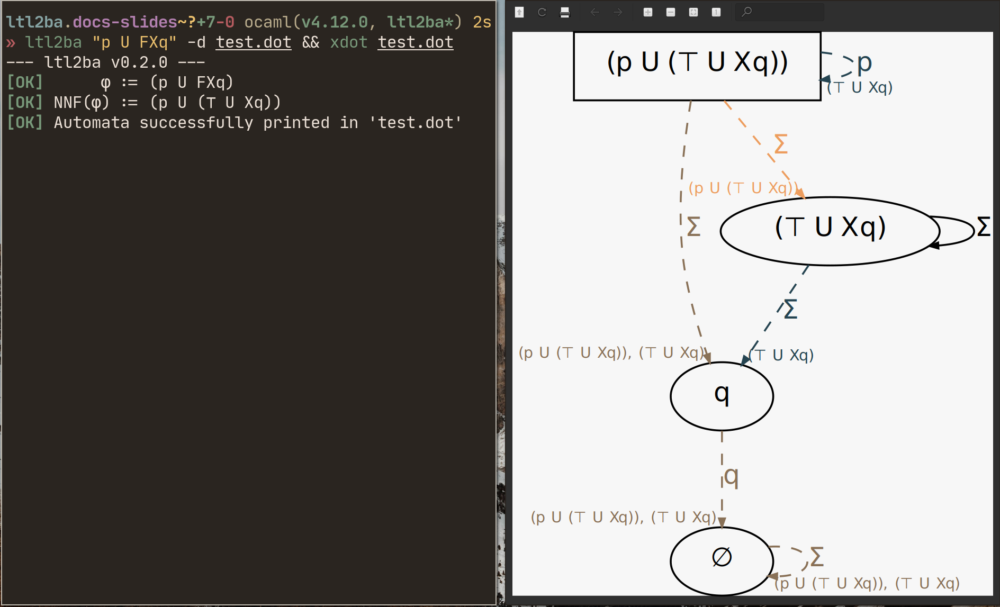

## Automates de Büchi sur _les transitions_

. . .

Même définition que pour un automate de Büchi généralisé :

\begin{center}
  $\mathcal{A} = (S, \rightarrow, S_0, F_1, ..., F_l)$
  \; avec \;
  $\forall i \in \{1, ..,  l\}, \; F_i \subseteq \; \rightarrow$
\end{center}

. . .

\begin{figure}[ht]
    \centering
    \begin{tikzpicture}[auto, on grid, every node]
        \node[state, initial] (x1) at (0, 0) {1};
        \node[state] (x2) at (2, 0) {2};
        \path (x1) edge [loop above] node{$\Sigma$} (x1);
        \path[dashed, thick] (x1) edge [bend left] node{$\ap{p}$} (x2);
        \path[dashed, thick] (x2) edge [loop above] node{$\ap{p}$} (x2);
        \path (x2) edge [bend left] node{$\Sigma$} (x1);
    \end{tikzpicture}
    \caption{Exemple d'automate reconnaissant la formule LTL $\op{GF}\ap{p}$, avec
   en pointillé, les transitions appartenant à l'unique condition d'acceptation.}
\end{figure}

## L'algorithme de traduction

### Intuition

Diviser la formule de départ $\varphi$ en sous-formules plus simple (dites
_réduites_) et ajouter une condition d'acceptation pour chaque sous-formule de
la forme $\alpha \op{U} \beta$.

. . .

### Étapes

1. Mise en forme normale négative de $\varphi$.
2. $S_0 = \{ \varphi \}$.
3. Pour chaque état Y dans $S$ :
    - Calculer un graphe orienté temporaire $\mathcal{G}_Y$.
    - Ajouter dans $\mathcal{A}$ les transitions et les nouveaux états
      correspondants grâce à $\mathcal{G}_Y$.

## L'algorithme de traduction

. . .

### Définition (_NNF_)

Une formule est en **forme normale négative** (_NNF_) si elle est constituée
uniquement des sous-formules suivantes :

- $\bot, \ap{p}$ et $\neg \ap{p}$ avec $\ap{p} \in$ AP
- $\op{X}\alpha$ et $\alpha \circledast \beta$ avec $\circledast \in \{\op{U, R, \vee, \wedge}\}$

. . .

### Définition (_ensemble réduit_)

Un ensemble de formules Z est **réduit** si :

- toutes les formules de Z sont **réduites**, c'est-à-dire, de la forme
  $\ap{p}$, $\neg \ap{p}$ ou $\op{X}\alpha$ avec $\ap{p} \in$ AP
- $\bot \notin$ Z, et $\{\ap{p}, \neg \ap{p}\} \nsubseteq$ Z pour tout $\ap{p} \in$ AP.

## L'algorithme de traduction

. . .

### Calcul de $\mathcal{G}_Y$

Soit Y = Z $\cup \{\alpha\}$ où $\alpha$ n'est pas réduite et si possible
maximale (càd.  n'est sous-formule d'aucune autre formule non réduite de Y).
Les arêtes à partir de Y sont :

- Si $\alpha = \alpha_1 \vee \alpha_2$, $Y \rightarrow Z \cup \{\alpha_1\}$ et
  $Y \rightarrow Z \cup \{\alpha_2\}$.
- Si $\alpha = \alpha_1 \wedge \alpha_2$, $Y \rightarrow Z \cup \{\alpha_1, \alpha_2\}$
- Si $\alpha = \alpha_1 \; \op{R} \; \alpha_2$, $Y \rightarrow Z \cup \{\alpha_1, \alpha_2\}$
  et  $Y \rightarrow Z \cup \{\op{X}\alpha, \alpha_2\}$.
- Si $\alpha = \alpha_1 \; \op{U} \; \alpha_2$, $Y \rightarrow Z \cup \{\alpha_2\}$
  et  $Y \rightarrow^{\alpha} Z \cup \{\op{X}\alpha, \alpha_1\}$.

. . .

\text{}\newline

Cette construction est appliquée récursivement jusqu'à ce que toutes les
feuilles du graphe soient réduites.

## L'algorithme de traduction

. . .

### Calcul des transitions à partir de Y

Finalement, une fois $\mathcal{G}_Y$ calculé, sont ajoutées dans $\mathcal{A}$ :

- les transitions suivantes $\{ Y \rightarrow^{\Sigma_{Z}} \text{next}(Z) \; | \; Z \in \text{Red}(Y)\}$
- pour chaque sous-formule $\alpha = \alpha_1 \; \op{U} \; \alpha_2$,
  les conditions d'acceptations $F_\alpha = \{ Y \rightarrow^{\Sigma_{Z}} \text{next}(Z) \; | \; Y \in S, \; Z \in \text{Red}_\alpha(Y)\}$

. . .

Avec,

\begin{align*}
  \text{Red}(Y)           &= \{ Z \text{ réduit} \; | \; Y \rightarrow^{*} Z\}\\
  \text{Red}_{\alpha}(Y)  &= \{ Z \text{ réduit} \; | \; Y \rightarrow^{* \setminus \alpha} Z\}\\
  \text{next}(Z)          &= \{ \alpha \; | \; \op{X}\alpha \in Z\}\\
  \Sigma_Z                &= \bigcap_{\ap{p} \in Z} \Sigma_{\ap{p}} \cap \bigcap_{\neg \ap{p} \in Z} \Sigma_{\neg \ap{p}}
\end{align*}


## Un exemple _comparé_ pour $\varphi = \ap{p} \; \op{U}\; \ap{q}$

### Algorithme classique

 On commence par calculer la clôture de la formule :

$cl(\varphi) = \{ \ap{p} \; \op{U}\; \ap{q} \; ; \op{\lnot} (\ap{p} \; \op{U}\; \ap{q}) \; ;
                   \op{X}( \ap{p} \; \op{U}\; \ap{q}) \; ; \op{\lnot} (\op{X}( \ap{p} \; \op{U}\; \ap{q})) \; ;
                   \ap{p} \; ; \op{\lnot} \ap{p} \; ; \ap{q} \; ; \op{\lnot} \ap{q} \} ;$

$cl(\varphi)$ est constitué de 8 formules (4 formules et leurs négations).


## Un exemple _comparé_ pour $\varphi = \ap{p} \; \op{U}\; \ap{q}$

<center>

On calcule ainsi les états consistants suivants :

{height=70%}

</center>

## Un exemple _comparé_ pour $\varphi = \ap{p} \; \op{U}\; \ap{q}$

<center>

On a ainsi l'automate suivant :

{height=70%}

A peine sale ...

</center>

## Un exemple _comparé_ pour $\varphi = \ap{p} \; \op{U}\; \ap{q}$

### Algorithme Malin

On commence par mettre l'état initial : c'est la formule actuelle :

\begin{figure}[ht]
    \centering
    \begin{tikzpicture}[auto, on grid, every node]
        \node[state, initial] (s0) at (0, 0) {$\ap{p} \; \op{U} \; \ap{q}$};
    \end{tikzpicture}
\end{figure}

## Un exemple _comparé_ pour $\varphi = \ap{p} \; \op{U}\; \ap{q}$


On construit ensuite le graphe temporaire pour l'état à considérer :

\begin{figure}[ht]
    \centering
    \begin{tikzpicture}[auto, on grid, every node]
      \node[state, initial] (0) at (0, 0) {$\ap{p} \; \op{U} \; \ap{q}$};
      \node[state, draw=Red, fill=Red!10] (1) at (-1, -3) {$\ap{q}$};
      \node[state, draw=Red, fill=Red!10] (2) at (1, -e) {$\ap{p}$, $\op{X}(\ap{p} \; \op{U} \; \ap{q})$};
      \path[thick] (0) edge node{} (1);
      \path[thick] (0) edge node{$\ap{p} \; \op{U} \; \ap{q}$} (2);
    \end{tikzpicture}
\end{figure}


## Un exemple _comparé_ pour $\varphi = \ap{p} \; \op{U}\; \ap{q}$

On ajoute ainsi les vrais états du graphe, en vert, à partir des états réduits
accessibles :

\begin{figure}[ht]
    \centering
    \begin{tikzpicture}[auto, on grid, every node]
      \node[state, initial] (0) at (0, 0) {$\ap{p} \; \op{U} \; \ap{q}$};
      \node[state, draw=Red!20, fill=Red!10] (1) at (0, -3) {$\ap{q}$};
      \node[state, draw=Red!20, fill=Red!10] (2) at (2, -3) {$\ap{p}$, $\op{X}(\ap{p} \; \op{U} \; \ap{q})$};
      \node[state, draw=Green, fill=Green!10] (3) at (-2, -3) {$\emptyset$};
      \path[] (0) edge node{} (1);
      \path[] (0) edge node{$\ap{p} \; \op{U} \; \ap{q}$} (2);
      \path[thick] (0) edge[loop right] node{$\ap{p}$} (0);
      \path[thick] (0) edge node{$\ap{q}$} (3);
    \end{tikzpicture}
\end{figure}

## Un exemple _comparé_ pour $\varphi = \ap{p} \; \op{U}\; \ap{q}$

On a un autre état à considérer, l'état vide. Comme il est réduit et qu'il ne contient pas d'état, il boucle sur lui même :

\begin{figure}[ht]
    \centering
    \begin{tikzpicture}[auto, on grid, every node]
      \node[state, initial] (0) at (0, 0) {$\ap{p} \; \op{U} \; \ap{q}$};
      \node[state, draw=Green, fill=Green!10] (3) at (0, -2) {$\emptyset$};
      \path[thick] (0) edge[loop right] node{$\ap{p}$} (0);
      \path[thick] (0) edge node{$\ap{q}$} (3);
      \path[thick] (3) edge[loop right] node{$\Sigma$} (3);
    \end{tikzpicture}
\end{figure}

## Un exemple _comparé_ pour $\varphi = \ap{p} \; \op{U}\; \ap{q}$

On retire les états temporaires. Comme il y a un Until, il faut ajouter un
ensemble de transitions d'acceptations, en bleu et pointillé :

\begin{figure}[ht]
    \centering
    \begin{tikzpicture}[auto, on grid, every node]
      \node[state, initial] (0) at (0, 0) {$\ap{p} \; \op{U} \; \ap{q}$};
      \node[state, draw=Green, fill=Green!10] (3) at (0, -2) {$\emptyset$};
      \path[thick] (0) edge[loop right] node{$\ap{p}$} (0);
      \path[thick, dashed, draw=Blue] (0) edge node{$\ap{q}$} (3);
      \path[thick, dashed, draw=Blue] (3) edge[loop right] node{$\Sigma$} (3);
    \end{tikzpicture}
\end{figure}

## (Un autre exemple pour $\varphi = \ap{p} \; \op{U}\; \op{FX}\ap{q}$)

Comme d'habitude, on commence par placer l'état initial, qui est $\varphi$ :

\begin{figure}[ht]
    \centering
    \begin{tikzpicture}[auto, on grid, every node]
      \node[state, initial] (0) at (0, 0) {$\ap{p} \; \op{U} \; \op{FX}\ap{q}$};
    \end{tikzpicture}
\end{figure}

## (Un autre exemple pour $\varphi = \ap{p} \; \op{U}\; \op{FX}\ap{q}$)

La deuxième étape est toujours la même, faire le graphe temporaire pour cet état accessible :

\begin{figure}[ht]
    \centering
    \scalebox{0.7}{%
    \begin{tikzpicture}[auto, on grid, every node]
      \node[state, initial] (0) at (0, 0) {$\ap{p} \; \op{U} \; \op{FX}\ap{q}$};
      \node[state, draw=Red, fill=Red!10] (1) at (-2, -3) {$\ap{p}, \op{X}(\ap{p} \; \op{U} \; \op{FX}\ap{q})$};
      \node[state, draw=Red, fill=Red!10] (2) at (1, -3) {$\op{FX}\ap{q}$};
      \node[state, draw=Red, fill=Red!10] (3) at (0, -6) {$\top, \op{X}(\op{FX}\ap{q})$};
      \node[state, draw=Red, fill=Red!10] (4) at (2, -6) {$\op{X}\ap{q}$};

      \path[thick] (0) edge node{$\ap{p} \; \op{U} \; \op{FX}\ap{q}$} (1);
      \path[thick] (0) edge node{} (2);
      \path[thick] (2) edge node{$\op{FX}\ap{q}$} (3);
      \path[thick] (2) edge node{} (4);
      \end{tikzpicture}
      }
\end{figure}

## (Un autre exemple pour $\varphi = \ap{p} \; \op{U}\; \op{FX}\ap{q}$)

La troisième étape consiste en créer les nouveaux états accessibles de l'automates à partir des états réduits du graphe temporaire :

\begin{figure}[ht]
    \centering
    \scalebox{0.7}{%
    \begin{tikzpicture}[auto, on grid, every node]
      \node[state, initial] (0) at (0, 0) {$\ap{p} \; \op{U} \; \op{FX}\ap{q}$};
      \node[state, draw=Red!20, fill=Red!10] (1) at (-5, -3) {$\ap{p}, \op{X}(\ap{p} \; \op{U} \; \op{FX}\ap{q})$};
      \node[state, draw=Red!20, fill=Red!10] (2) at (-1, -3) {$\op{FX}\ap{q}$};
      \node[state, draw=Red!20, fill=Red!10] (3) at (-3, -6) {$\top, \op{X}(\op{FX}\ap{q})$};
      \node[state, draw=Red!20, fill=Red!10] (4) at (-1, -6) {$\op{X}\ap{q}$};
      \node[state] (5) at (1, -3) {$\ap{q}$};
      \node[state] (6) at (4, -3) {$\op{FX}\ap{q}$};

      \path[thick] (0) edge[loop right] node{$\ap{p}$} (0);
      \path[thick] (0) edge node{} (5);
      \path[thick] (0) edge node{} (6);
      \path[] (0) edge node{$\ap{p} \; \op{U} \; \op{FX}\ap{q}$} (1);
      \path[] (0) edge node{} (2);
      \path[] (2) edge node{$\op{FX}\ap{q}$} (3);
      \path[] (2) edge node{} (4);
      \end{tikzpicture}
      }
\end{figure}

## (Un autre exemple pour $\varphi = \ap{p} \; \op{U}\; \op{FX}\ap{q}$)

On a de nouveaux états accessibles, il faut les considérer un par un. Comme
l'état $\{\ap{q}\}$ est déjà réduit, il ne crée aucun état intermédiaire, et
permet d'accéder à un nouvel état :

\begin{figure}[ht]
    \centering
    \scalebox{0.7}{%
      \begin{tikzpicture}[auto, on grid, every node]
        \node[state, initial] (0) at (0, 0) {$\ap{p} \; \op{U} \; \op{FX}\ap{q}$};
        \node[state, draw=Red!20, fill=Red!10] (1) at (-5, -3) {$\ap{p}, \op{X}(\ap{p} \; \op{U} \; \op{FX}\ap{q})$};
        \node[state, draw=Red!20, fill=Red!10] (2) at (-1, -3) {$\op{FX}\ap{q}$};
        \node[state, draw=Red!20, fill=Red!10] (3) at (-3, -6) {$\top, \op{X}(\op{FX}\ap{q})$};
        \node[state, draw=Red!20, fill=Red!10] (4) at (-1, -6) {$\op{X}\ap{q}$};
        \node[state] (5) at (1, -3) {$\ap{q}$};
        \node[state] (6) at (4, -3) {$\op{FX}\ap{q}$};
        \node[state] (7) at (1, -6) {$\emptyset$};

        \path[thick] (0) edge[loop right] node{$\ap{p}$} (0);
        \path[thick] (0) edge node{} (5);
        \path[thick] (0) edge node{} (6);
        \path[thick] (5) edge node{$\ap{q}$} (7);
        \path[] (0) edge node{$\ap{p} \; \op{U} \; \op{FX}\ap{q}$} (1);
        \path[] (0) edge node{} (2);
        \path[] (2) edge node{$\op{FX}\ap{q}$} (3);
        \path[] (2) edge node{} (4);
        \end{tikzpicture}
      }
\end{figure}

## (Un autre exemple pour $\varphi = \ap{p} \; \op{U}\; \op{FX}\ap{q}$)

On considère maintenant l'état  $\{\op{FX}\ap{q}\}$, qui crée un nouveau graphe
intermédiaire :

\begin{figure}[ht]
    \centering
    \scalebox{0.7}{%
      \begin{tikzpicture}[auto, on grid, every node]
        \node[state, initial] (0) at (0, 0) {$\ap{p} \; \op{U} \; \op{FX}\ap{q}$};
        \node[state, draw=Red!20, fill=Red!10] (1) at (-5, -3) {$\ap{p}, \op{X}(\ap{p} \; \op{U} \; \op{FX}\ap{q})$};
        \node[state, draw=Red!20, fill=Red!10] (2) at (-1, -3) {$\op{FX}\ap{q}$};
        \node[state, draw=Red!20, fill=Red!10] (3) at (0, -6) {$\top, \op{X}(\op{FX}\ap{q})$};
        \node[state, draw=Red!20, fill=Red!10] (4) at (-3, -6) {$\op{X}\ap{q}$};
        \node[state] (5) at (4, -3) {$\ap{q}$};
        \node[state] (6) at (1, -3) {$\op{FX}\ap{q}$};
        \node[state] (7) at (4, -6) {$\emptyset$};

        \path[thick] (0) edge[loop right] node{$\ap{p}$} (0);
        \path[thick] (0) edge node{} (5);
        \path[thick] (0) edge node{} (6);
        \path[thick] (5) edge node{} (7);
        \path[thick] (6) edge node{$\op{FX}\ap{q}$} (4);
        \path[thick] (6) edge node{$\op{FX}\ap{q}$} (3);
        \path[] (0) edge node{$\ap{p} \; \op{U} \; \op{FX}\ap{q}$} (1);
        \path[] (0) edge node{} (2);
        \path[] (2) edge[bend right] node{$\op{FX}\ap{q}$} (3);
        \path[] (2) edge node{} (4);
      \end{tikzpicture}
      }
\end{figure}

## (Un autre exemple pour $\varphi = \ap{p} \; \op{U}\; \op{FX}\ap{q}$)

... et ainsi les nouvelles transitions suivantes :

\begin{figure}[ht]
    \centering
    \scalebox{0.6}{%
      \begin{tikzpicture}[auto, on grid, every node]
        \node[state, initial] (0) at (0, 0) {$\ap{p} \; \op{U} \; \op{FX}\ap{q}$};
        \node[state, draw=Red!20, fill=Red!10] (1) at (-5, -3) {$\ap{p}, \op{X}(\ap{p} \; \op{U} \; \op{FX}\ap{q})$};
        \node[state, draw=Red!20, fill=Red!10] (2) at (-1, -3) {$\op{FX}\ap{q}$};
        \node[state, draw=Red!20, fill=Red!10] (3) at (0, -6) {$\top, \op{X}(\op{FX}\ap{q})$};
        \node[state, draw=Red!20, fill=Red!10] (4) at (-3, -6) {$\op{X}\ap{q}$};
        \node[state] (5) at (4, -6) {$\ap{q}$};
        \node[state] (6) at (1, -3) {$\op{FX}\ap{q}$};
        \node[state] (7) at (4, -9) {$\emptyset$};

        \path[thick] (0) edge[loop right] node{$\ap{p}$} (0);
        \path[thick] (0) edge[bend left] node{} (5);
        \path[thick] (0) edge node{} (6);
        \path[thick] (5) edge node{$\ap{q}$} (7);
        \path[thick] (6) edge node{} (5);
        \path[thick] (6) edge[loop right] node{} (6);
        \path[] (6) edge node{$\op{FX}\ap{q}$} (4);
        \path[] (6) edge node{$\op{FX}\ap{q}$} (3);
        \path[] (0) edge node{$\ap{p} \; \op{U} \; \op{FX}\ap{q}$} (1);
        \path[] (0) edge node{} (2);
        \path[] (2) edge[bend right] node{$\op{FX}\ap{q}$} (3);
        \path[] (2) edge node{} (4);
      \end{tikzpicture}
      }
\end{figure}

## (Un autre exemple pour $\varphi = \ap{p} \; \op{U}\; \op{FX}\ap{q}$)

Il reste enfin le dernier état, vide. Il est réduit, on boucle :

\begin{figure}[ht]
    \centering
    \scalebox{0.6}{%
      \begin{tikzpicture}[auto, on grid, every node]
        \node[state, initial] (0) at (0, 0) {$\ap{p} \; \op{U} \; \op{FX}\ap{q}$};
        \node[state, draw=Red!20, fill=Red!10] (1) at (-5, -3) {$\ap{p}, \op{X}(\ap{p} \; \op{U} \; \op{FX}\ap{q})$};
        \node[state, draw=Red!20, fill=Red!10] (2) at (-1, -3) {$\op{FX}\ap{q}$};
        \node[state, draw=Red!20, fill=Red!10] (3) at (0, -6) {$\top, \op{X}(\op{FX}\ap{q})$};
        \node[state, draw=Red!20, fill=Red!10] (4) at (-3, -6) {$\op{X}\ap{q}$};
        \node[state] (5) at (4, -6) {$\ap{q}$};
        \node[state] (6) at (1, -3) {$\op{FX}\ap{q}$};
        \node[state] (7) at (4, -9) {$\emptyset$};

        \path[thick] (0) edge[loop right] node{$\ap{p}$} (0);
        \path[thick] (0) edge[bend left] node{} (5);
        \path[thick] (0) edge node{} (6);
        \path[thick] (5) edge node{$\ap{q}$} (7);
        \path[thick] (6) edge node{} (5);
        \path[thick] (6) edge[loop right] node{} (6);
        \path[thick] (7) edge[loop right] node{} (7);
        \path[] (6) edge node{$\op{FX}\ap{q}$} (4);
        \path[] (6) edge node{$\op{FX}\ap{q}$} (3);
        \path[] (0) edge node{$\ap{p} \; \op{U} \; \op{FX}\ap{q}$} (1);
        \path[] (0) edge node{} (2);
        \path[] (2) edge[bend right] node{$\op{FX}\ap{q}$} (3);
        \path[] (2) edge node{} (4);
      \end{tikzpicture}
      }
\end{figure}

## (Un autre exemple pour $\varphi = \ap{p} \; \op{U}\; \op{FX}\ap{q}$)

On a terminé. On retire les états temporaires :

\begin{figure}[ht]
    \centering
    \scalebox{0.7}{%
      \begin{tikzpicture}[auto, on grid, every node]
        \node[state, initial] (0) at (0, 0) {$\ap{p} \; \op{U} \; \op{FX}\ap{q}$};
        \node[state] (5) at (0, -4) {$\ap{q}$};
        \node[state] (6) at (1.5, -2) {$\op{FX}\ap{q}$};
        \node[state] (7) at (0, -6) {$\emptyset$};

        \path[thick] (0) edge[loop right] node{$\ap{p}$} (0);
        \path[thick] (0) edge node{} (5);
        \path[thick] (0) edge node{} (6);
        \path[thick] (5) edge node{$\ap{q}$} (7);
        \path[thick] (6) edge node{} (5);
        \path[thick] (6) edge[loop right] node{} (6);
        \path[thick] (7) edge[loop right] node{} (7);
      \end{tikzpicture}
      }
\end{figure}

## (Un autre exemple pour $\varphi = \ap{p} \; \op{U}\; \op{FX}\ap{q}$)

On a deux formules Until. On ajoute donc deux ensembles d'états acceptants :

\begin{figure}[ht]
    \centering
    \scalebox{0.7}{%
      \begin{tikzpicture}[auto, on grid, every node]
        \node[state, initial] (0) at (0, 0) {$\ap{p} \; \op{U} \; \op{FX}\ap{q}$};
        \node[state] (5) at (0, -4) {$\ap{q}$};
        \node[state] (6) at (1.5, -2) {$\op{FX}\ap{q}$};
        \node[state] (7) at (0, -6) {$\emptyset$};

        \path[thick, draw=Red] (0) edge[loop right] node{$\ap{p}$} (0);
        \path[thick, draw=Red!50!Blue] (0) edge node{} (5);
        \path[thick, draw=Red!50!Blue] (0) edge node{} (6);
        \path[thick, draw=Red!50!Blue] (5) edge node{$\ap{q}$} (7);
        \path[thick, draw=Red!50!Blue] (6) edge node{} (5); \path[thick, draw=Blue] (6) edge[loop right] node{} (6);
        \path[thick, draw=Red!50!Blue] (7) edge[loop right] node{} (7);
      \end{tikzpicture}
      }
\end{figure}


## L'implémentation d'Emile

{width=\textwidth}

## L'implémentation d'Emile

Principales caractéristiques :

- Est implémenté en OCaml.
- Le parseur utilise `ocamllex` et `menhir`.
- Une soixantaine de test unitaires sont effectués avec `alcotest` et exécutés
  en intégration continue avec `GitHub`.
- Ne calcule pas le graphe intermédiaire mais directement l'ensemble des feuilles réduites.

## L'implémentation d'Emile

En particulier, la fonction `val red : state -> red_states` retourne un record de type :

```ocaml
type red_states =
  { all : StateSet.t
  ; marked_by : StateSet.t FormulaMap.t
  }
```

Où `all` représente l'ensemble des états réduits accessible en utilisant
**aucune** arête marquée et `marked_by` est une map avec comme clé les formules
de la forme $\alpha = \alpha_1 \; \op{U} \; \alpha_2$ et en valeur l'ensemble
des états réduits accessible en utilisant **uniquement** des arêtes marquées
par $\alpha$.

. . .

Donc finalement :
\begin{align*}
\text{Red}(Y)         &= \texttt{all} \cup \bigcup_{\alpha \in \texttt{marked\_by.keys}} \texttt{marked\_by}[\alpha]\\
\text{Red}_\alpha(Y)  &= \text{Red}(Y) \setminus \texttt{marked\_by}[\alpha]
\end{align*}

## L'implémentation d'Emile

Principales caractéristiques :

- Est implémenté en OCaml.
- Le parseur utilise `ocamllex` et `menhir`.
- Une soixantaine de test unitaires sont effectués avec `alcotest` et exécutés
  en intégration continue avec `GitHub`.
- Ne calcule pas le graphe intermédiaire mais directement l'ensemble des
  feuilles réduites.
- L'automate est défini comme un graphe orienté et utilise `ocamlgraph` pour
  l'implémentation.

## L'implémentation d'Emile

```ocaml
module TransBuchi : sig
  include
    Graph.Sig.I
      with type V.t =
        [ `Init of state
        | `Normal of state
        ]
       and type E.label =
        [ `Normal of FormulaSet.t
        | `Acceptant of Ltl.formula list * FormulaSet.t
        ]
end
```
