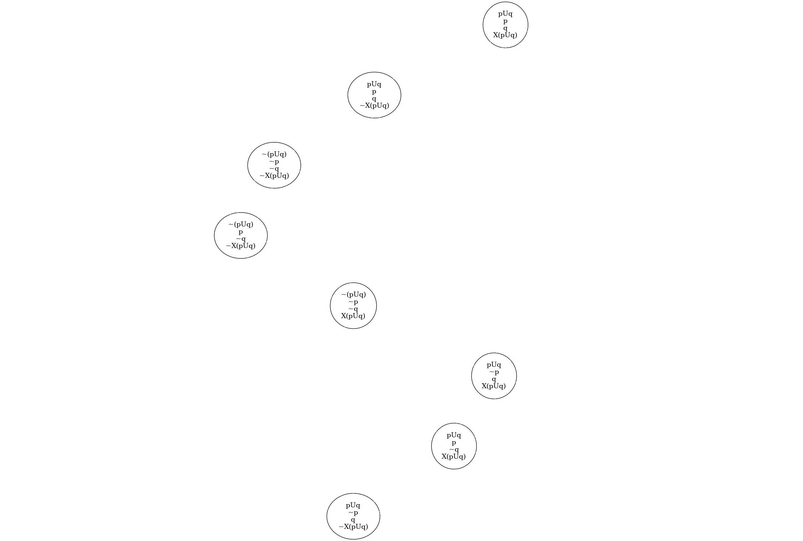
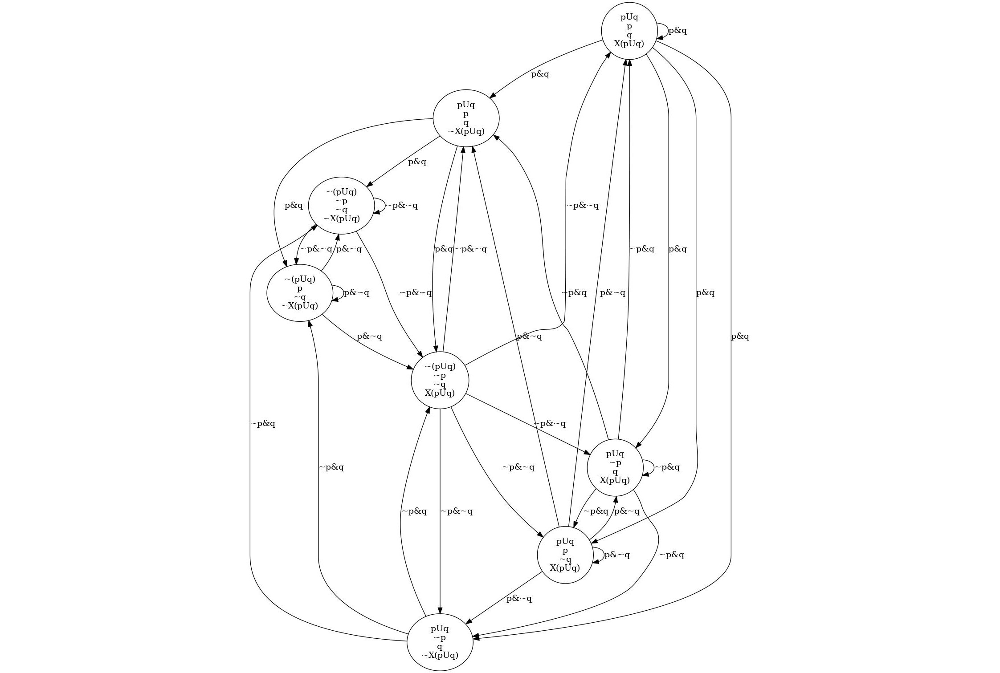

## Automates de Büchi sur _les transitions_

. . .

Même définition que pour un automate de Büchi généralisé :

\begin{center}
  $\mathcal{A} = (S, \rightarrow, S_0, F_1, ..., F_l)$
  \; avec \;
  $\forall i \in \{1, ..,  l\}, \; F_i \subseteq \; \rightarrow$
\end{center}

. . .

\begin{figure}[ht]
    \centering
    \begin{tikzpicture}[auto, on grid, every node]
        \node[state, initial] (x1) at (0, 0) {1};
        \node[state] (x2) at (2, 0) {2};
        \path (x1) edge [loop above] node{$\Sigma$} (x1);
        \path[dashed, thick] (x1) edge [bend left] node{$\ap{p}$} (x2);
        \path[dashed, thick] (x2) edge [loop above] node{$\ap{p}$} (x2);
        \path (x2) edge [bend left] node{$\Sigma$} (x1);
    \end{tikzpicture}
    \caption{Exemple d'automate reconnaissant la formule LTL $\op{GF}\ap{p}$, avec
   en pointillé, les transitions appartenant à l'unique condition d'acceptation.}
\end{figure}

## L'algorithme de traduction

### Intuition

Diviser la formule de départ $\varphi$ en sous-formules plus simple (dites
_réduites_) et ajouter une condition d'acceptation pour chaque sous-formule de
la forme $\alpha \op{U} \beta$.

. . .

### Étapes

1. Mise en forme normale négative de $\varphi$.
2. $S_0 = \{ \varphi \}$.
3. Pour chaque état Y dans $S$ :
    - Calculer un graphe orienté temporaire $\mathcal{G}_Y$.
    - Ajouter dans $\mathcal{A}$ les transitions et les nouveaux états
      correspondants grâce à $\mathcal{G}_Y$.

## L'algorithme de traduction

. . .

### Définition (_NNF_)

Une formule est en **forme normale négative** (_NNF_) si elle est constituée
uniquement des sous-formules suivantes :

- $\bot, \ap{p}$ et $\neg \ap{p}$ avec $\ap{p} \in$ AP
- $\op{X}\alpha$ et $\alpha \circledast \beta$ avec $\circledast \in \{\op{U, R, \vee, \wedge}\}$

. . .

### Définition (_ensemble réduit_)

Un ensemble de formules Z est **réduit** si :

- toutes les formules de Z sont **réduites**, c'est-à-dire, de la forme
  $\ap{p}$, $\neg \ap{p}$ ou $\op{X}\alpha$ avec $\ap{p} \in$ AP
- $\bot \notin$ Z, et $\{\ap{p}, \neg \ap{p}\} \nsubseteq$ Z pour tout $\ap{p} \in$ AP.

## L'algorithme de traduction

. . .

### Calcul de $\mathcal{G}_Y$

Soit Y = Z $\cup \{\alpha\}$ où $\alpha$ n'est pas réduite et si possible
maximale (càd.  n'est sous-formule d'aucune autre formule non réduite de Y).
Les arêtes à partir de Y sont :

- Si $\alpha = \alpha_1 \vee \alpha_2$, $Y \rightarrow Z \cup \{\alpha_1\}$ et
  $Y \rightarrow Z \cup \{\alpha_2\}$.
- Si $\alpha = \alpha_1 \wedge \alpha_2$, $Y \rightarrow Z \cup \{\alpha_1, \alpha_2\}$
- Si $\alpha = \alpha_1 \; \op{R} \; \alpha_2$, $Y \rightarrow Z \cup \{\alpha_1, \alpha_2\}$
  et  $Y \rightarrow Z \cup \{\op{X}\alpha, \alpha_2\}$.
- Si $\alpha = \alpha_1 \; \op{U} \; \alpha_2$, $Y \rightarrow Z \cup \{\alpha_2\}$
  et  $Y \rightarrow^{\alpha} Z \cup \{\op{X}\alpha, \alpha_1\}$.

. . .

\text{}\newline

Cette construction est appliquée récursivement jusqu'à ce que toutes les
feuilles du graphe soient réduites.

## L'algorithme de traduction

. . .

### Calcul des transitions à partir de Y

Finalement, une fois $\mathcal{G}_Y$ calculé, sont ajoutées dans $\mathcal{A}$ :

- les transitions suivantes $\{ Y \rightarrow^{\Sigma_{Z}} \text{next}(Z) \; | \; Z \in \text{Red}(Y)\}$
- pour chaque sous-formule $\alpha = \alpha_1 \; \op{U} \; \alpha_2$,
  les conditions d'acceptations $F_\alpha = \{ Y \rightarrow^{\Sigma_{Z}} \text{next}(Z) \; | \; Y \in S, \; Z \in \text{Red}_\alpha(Y)\}$

. . .

Avec,

\begin{align*}
  \text{Red}(Y)           &= \{ Z \text{ réduit} \; | \; Y \rightarrow^{*} Z\}\\
  \text{Red}_{\alpha}(Y)  &= \{ Z \text{ réduit} \; | \; Y \rightarrow^{* \setminus \alpha} Z\}\\
  \text{next}(Z)          &= \{ \alpha \; | \; \op{X}\alpha \in Z\}\\
  \Sigma_Z                &= \bigcap_{\ap{p} \in Z} \Sigma_{\ap{p}} \cap \bigcap_{\neg \ap{p} \in Z} \Sigma_{\neg \ap{p}}
\end{align*}

## Un exemple _comparé_ pour $\varphi = \ap{p} \; \op{U}\; \ap{q}$

### Algorithme classique

 On commence par calculer la clôture de la formule :

$cl(\varphi) = \{ \ap{p} \; \op{U}\; \ap{q} \; ; \op{\lnot} (\ap{p} \; \op{U}\; \ap{q}) \; ;
                   \op{X}( \ap{p} \; \op{U}\; \ap{q}) \; ; \op{\lnot} (\op{X}( \ap{p} \; \op{U}\; \ap{q})) \; ;
                   \ap{p} \; ; \op{\lnot} \ap{p} \; ; \ap{q} \; ; \op{\lnot} \ap{q} \} ;$

$cl(\varphi)$ est constitué de 8 formules (4 formules et leurs négations).

## Un exemple _comparé_ pour $\varphi = \ap{p} \; \op{U}\; \ap{q}$

On calcule ainsi les états consistants suivants :

{height=70%}

## Un exemple _comparé_ pour $\varphi = \ap{p} \; \op{U}\; \ap{q}$

On a ainsi l'automate suivant :

{height=70%}

A peine sale ...

## Un exemple _comparé_ pour $\varphi = \ap{p} \; \op{U}\; \ap{q}$

### Algorithme Malin

On commence par mettre l'état initial : c'est la formule actuelle :

<!-- \begin{figure}[ht] -->
<!--     \centering -->
<!--     \begin{tikzpicture}[>=latex',line join=bevel,] -->
<!--     %% -->
<!--     \node (0) at (27.0bp,18.0bp) [draw=green,circle] {pUq}; -->
<!--     % -->
<!--     \end{tikzpicture} -->
<!-- \end{figure} -->
\begin{figure}[ht]
    \centering
    \begin{tikzpicture}[auto, on grid, every node]
        \node[state, initial] (s0) at (0, 0) {$\ap{p} \; \op{U} \; \ap{q}$};
    \end{tikzpicture}
\end{figure}

## Un exemple _comparé_ pour $\varphi = \ap{p} \; \op{U}\; \ap{q}$

On construit ensuite le graphe temporaire pour l'état à considérer :

\begin{figure}[ht]
    \centering
    \begin{tikzpicture}[auto, on grid, every node]
      \node[state, initial] (0) at (0, 0) {$\ap{p} \; \op{U} \; \ap{q}$};
      \node[state, draw=Red, fill=Red!10] (1) at (-1, -3) {$\ap{q}$};
      \node[state, draw=Red, fill=Red!10] (2) at (1, -e) {$\ap{p}$, $\op{X}(\ap{p} \; \op{U} \; \ap{q})$};
      \path[thick] (0) edge node{} (1);
      \path[thick] (0) edge node{$\ap{p} \; \op{U} \; \ap{q}$} (2);
    \end{tikzpicture}
\end{figure}

## Un exemple _comparé_ pour $\varphi = \ap{p} \; \op{U}\; \ap{q}$

On ajoute ainsi les vrais états du graphe, en vert, à partir des états réduits
accessibles :

<!-- \begin{figure}[ht] -->
<!--     \centering -->
<!--     \begin{tikzpicture}[>=latex',line join=bevel,] -->
<!--     %% -->
<!--     \node (0) at (114.0bp,122.74bp) [draw=green,circle] {pUq}; -->
<!--       \node (1) at (27.0bp,26.87bp) [draw=red,circle] {q}; -->
<!--       \node (2) at (114.0bp,26.87bp) [draw=red,circle] {\begin{tabular}{c} p \\ X(pUq) \end{tabular}}; -->
<!--       \node (3) at (201.0bp,26.87bp) [draw=green,circle,text width=0.5cm] {      }; -->
<!--       \draw [green,->] (0) ..controls (149.51bp,131.23bp) and (159.0bp,128.65bp)  .. (159.0bp,122.74bp) .. controls (159.0bp,118.77bp) and (154.72bp,116.3bp)  .. (0); -->
<!--       \definecolor{strokecol}{rgb}{0.0,0.0,0.0}; -->
<!--       \pgfsetstrokecolor{strokecol} -->
<!--       \draw (162.5bp,122.74bp) node {p}; -->
<!--       \draw [red,->] (0) ..controls (86.316bp,91.869bp) and (64.11bp,67.911bp)  .. (1); -->
<!--       \draw [red,->] (0) ..controls (114.0bp,93.219bp) and (114.0bp,78.009bp)  .. (2); -->
<!--       \draw (126.0bp,79.24bp) node {pUq}; -->
<!--       \draw [green,->] (0) ..controls (141.68bp,91.869bp) and (163.89bp,67.911bp)  .. (3); -->
<!--       \draw (163.5bp,79.24bp) node {q}; -->
<!--     % -->
<!--     \end{tikzpicture} -->
<!-- \end{figure} -->

\begin{figure}[ht]
    \centering
    \begin{tikzpicture}[auto, on grid, every node]
      \node[state, initial] (0) at (0, 0) {$\ap{p} \; \op{U} \; \ap{q}$};
      \node[state, draw=Red!20, fill=Red!10] (1) at (0, -3) {$\ap{q}$};
      \node[state, draw=Red!20, fill=Red!10] (2) at (2, -3) {$\ap{p}$, $\op{X}(\ap{p} \; \op{U} \; \ap{q})$};
      \node[state, draw=Green, fill=Green!10] (3) at (-2, -3) {$\emptyset$};
      \path[] (0) edge node{} (1);
      \path[] (0) edge node{$\ap{p} \; \op{U} \; \ap{q}$} (2);
      \path[thick] (0) edge[loop right] node{$\ap{p}$} (0);
      \path[thick] (0) edge node{$\ap{q}$} (3);
    \end{tikzpicture}
\end{figure}

## Un exemple _comparé_ pour $\varphi = \ap{p} \; \op{U}\; \ap{q}$

On a un autre état à considérer, l'état vide. Comme il est réduit et qu'il ne contient pas d'état, il boucle sur lui même :

<!-- \begin{figure}[ht] -->
<!--     \centering -->
<!--     \begin{tikzpicture}[>=latex',line join=bevel,] -->
<!--     %% -->
<!--     \node (0) at (114.0bp,122.74bp) [draw=green,circle] {pUq}; -->
<!--       \node (1) at (27.0bp,26.87bp) [draw=red,circle] {q}; -->
<!--       \node (2) at (114.0bp,26.87bp) [draw=red,circle] {\begin{tabular}{c} p \\ X(pUq) \end{tabular}}; -->
<!--       \node (3) at (201.0bp,26.87bp) [draw=green,circle,text width=0.5cm] {      }; -->
<!--       \draw [green,->] (0) ..controls (149.51bp,131.23bp) and (159.0bp,128.65bp)  .. (159.0bp,122.74bp) .. controls (159.0bp,118.77bp) and (154.72bp,116.3bp)  .. (0); -->
<!--       \definecolor{strokecol}{rgb}{0.0,0.0,0.0}; -->
<!--       \pgfsetstrokecolor{strokecol} -->
<!--       \draw (162.5bp,122.74bp) node {p}; -->
<!--       \draw [red,->] (0) ..controls (86.316bp,91.869bp) and (64.11bp,67.911bp)  .. (1); -->
<!--       \draw [red,->] (0) ..controls (114.0bp,93.219bp) and (114.0bp,78.009bp)  .. (2); -->
<!--       \draw (126.0bp,79.24bp) node {pUq}; -->
<!--       \draw [green,->] (0) ..controls (141.68bp,91.869bp) and (163.89bp,67.911bp)  .. (3); -->
<!--       \draw (163.5bp,79.24bp) node {q}; -->
<!--       \draw [green,->] (3) ..controls (235.7bp,37.641bp) and (246.0bp,34.487bp)  .. (246.0bp,26.87bp) .. controls (246.0bp,21.633bp) and (241.13bp,18.506bp)  .. (3); -->
<!--     % -->
<!--     \end{tikzpicture} -->
<!-- \end{figure} -->

\begin{figure}[ht]
    \centering
    \begin{tikzpicture}[auto, on grid, every node]
      \node[state, initial] (0) at (0, 0) {$\ap{p} \; \op{U} \; \ap{q}$};
      \node[state, draw=Green, fill=Green!10] (3) at (0, -2) {$\emptyset$};
      \path[thick] (0) edge[loop right] node{$\ap{p}$} (0);
      \path[thick] (0) edge node{$\ap{q}$} (3);
      \path[thick] (3) edge[loop right] node{$\Sigma$} (3);
    \end{tikzpicture}
\end{figure}

## Un exemple _comparé_ pour $\varphi = \ap{p} \; \op{U}\; \ap{q}$

On retire les états temporaires. Comme il y a un Until, il faut ajouter un
ensemble de transitions d'acceptations, en bleu et pointillé :

\begin{figure}[ht]
    \centering
    \begin{tikzpicture}[auto, on grid, every node]
      \node[state, initial] (0) at (0, 0) {$\ap{p} \; \op{U} \; \ap{q}$};
      \node[state, draw=Green, fill=Green!10] (3) at (0, -2) {$\emptyset$};
      \path[thick] (0) edge[loop right] node{$\ap{p}$} (0);
      \path[thick, dashed, draw=Blue] (0) edge node{$\ap{q}$} (3);
      \path[thick, dashed, draw=Blue] (3) edge[loop right] node{$\Sigma$} (3);
    \end{tikzpicture}
\end{figure}

<!-- \begin{figure}[ht] -->
<!--     \centering -->
<!--     \begin{tikzpicture}[>=latex',line join=bevel,] -->
<!--     %% -->
<!--     \node (0) at (114.0bp,122.74bp) [draw=green,circle] {pUq}; -->
<!--       \node (1) at (27.0bp,26.87bp) [draw=white,circle] {}; -->
<!--       \node (2) at (114.0bp,26.87bp) [draw=white,circle] {}; -->
<!--       \node (3) at (201.0bp,26.87bp) [draw=green,circle,text width=0.5cm] { }; -->
<!--       \draw [black,->] (0) ..controls (149.51bp,131.23bp) and (159.0bp,128.65bp)  .. (159.0bp,122.74bp) .. controls (159.0bp,118.77bp) and (154.72bp,116.3bp)  .. (0); -->
<!--       \definecolor{strokecol}{rgb}{0.0,0.0,0.0}; -->
<!--       \pgfsetstrokecolor{strokecol} -->
<!--       \draw (162.5bp,122.74bp) node {p}; -->
<!--       \draw [white,->] (0) ..controls (86.316bp,91.869bp) and (64.11bp,67.911bp)  .. (1); -->
<!--       \draw [white,->] (0) ..controls (114.0bp,93.219bp) and (114.0bp,78.009bp)  .. (2); -->
<!--       \definecolor{strokecol}{rgb}{1.0,1.0,1.0}; -->
<!--       \pgfsetstrokecolor{strokecol} -->
<!--       \draw [blue,->] (0) ..controls (141.68bp,91.869bp) and (163.89bp,67.911bp)  .. (3); -->
<!--       \definecolor{strokecol}{rgb}{0.0,0.0,0.0}; -->
<!--       \pgfsetstrokecolor{strokecol} -->
<!--       \draw (163.5bp,79.24bp) node {q}; -->
<!--       \draw [blue,->] (3) ..controls (235.7bp,37.641bp) and (246.0bp,34.487bp)  .. (246.0bp,26.87bp) .. controls (246.0bp,21.633bp) and (241.13bp,18.506bp)  .. (3); -->
<!--     % -->
<!--     \end{tikzpicture} -->
<!-- \end{figure} -->

## (Un autre exemple pour $\varphi = \ap{p} \; \op{U}\; \op{FX}\ap{q}$)

Comme d'habitude, on commence par placer l'état initial, qui est $\varphi$ :

\begin{figure}[ht]
    \centering
      \begin{tikzpicture}[>=latex',line join=bevel,]
      %%
      \node (0) at (42.896bp,18.0bp) [draw=green,circle] {pU(FXq)};
      %
      \end{tikzpicture}
\end{figure}

## (Un autre exemple pour $\varphi = \ap{p} \; \op{U}\; \op{FX}\ap{q}$)

La deuxième étape est toujours la même, faire le graphe temporaire pour cet état accessible :

\begin{figure}[ht]
    \centering
    \scalebox{0.7}{%
      \begin{tikzpicture}[>=latex',line join=bevel]
      %%
      \node (0) at (94.933bp,227.48bp) [draw=green,circle] {pU(FXq)};
        \node (1) at (62.933bp,131.61bp) [draw=red,circle] {\begin{tabular}{c} p \\ X(pU(FXq)) \end{tabular}};
        \node (2) at (170.93bp,131.61bp) [draw=red,circle] {FXq};
        \node (3) at (126.93bp,26.87bp) [draw=red,circle] {\begin{tabular}{c} T \\ X(FXq) \end{tabular}};
        \node (4) at (213.93bp,26.87bp) [draw=red,circle] {Xq};
        \draw [red,->] (0) ..controls (85.172bp,197.85bp) and (79.923bp,182.45bp)  .. (1);
        \definecolor{strokecol}{rgb}{0.0,0.0,0.0};
        \pgfsetstrokecolor{strokecol}
        \draw (107.93bp,183.98bp) node {pU(FXq)};
        \draw [red,->] (0) ..controls (121.58bp,205.42bp) and (128.99bp,198.54bp)  .. (134.93bp,191.48bp) .. controls (143.53bp,181.28bp) and (151.46bp,168.81bp)  .. (2);
        \draw [red,->] (2) ..controls (157.92bp,100.22bp) and (149.22bp,79.915bp)  .. (3);
        \draw (164.43bp,79.24bp) node {FXq};
        \draw [red,->] (2) ..controls (184.67bp,97.777bp) and (195.23bp,72.554bp)  .. (4);
      %
      \end{tikzpicture}
      }
\end{figure}

## (Un autre exemple pour $\varphi = \ap{p} \; \op{U}\; \op{FX}\ap{q}$)

La troisième étape consiste en créer les nouveaux états accessibles de l'automates à partir des états réduits du graphe temporaire :

\begin{figure}[ht]
    \centering
    \scalebox{0.7}{%
        \begin{tikzpicture}[>=latex',line join=bevel,]
        %%
        \node (0) at (224.93bp,227.48bp) [draw=green,circle] {pU(FXq)};
          \node (1) at (62.933bp,131.61bp) [draw=red,circle] {\begin{tabular}{c} p \\ X(pU(FXq)) \end{tabular}};
          \node (2) at (170.93bp,131.61bp) [draw=red,circle] {FXq};
          \node (5) at (242.93bp,131.61bp) [draw=green,circle] {q};
          \node (6) at (314.93bp,131.61bp) [draw=green,circle] {FXq};
          \node (3) at (127.93bp,26.87bp) [draw=red,circle] {\begin{tabular}{c} T \\ X(FXq) \end{tabular}};
          \node (4) at (214.93bp,26.87bp) [draw=red,circle] {Xq};
          \draw [green,->] (0) ..controls (275.99bp,235.27bp) and (285.83bp,232.65bp)  .. (285.83bp,227.48bp) .. controls (285.83bp,223.85bp) and (280.97bp,221.47bp)  .. (0);
          \definecolor{strokecol}{rgb}{0.0,0.0,0.0};
          \pgfsetstrokecolor{strokecol}
          \draw (289.33bp,227.48bp) node {p};
          \draw [red,->] (0) ..controls (177.77bp,208.82bp) and (158.93bp,200.62bp)  .. (142.93bp,191.48bp) .. controls (127.93bp,182.91bp) and (112.41bp,172.03bp)  .. (1);
          \draw (167.93bp,183.98bp) node {pU(FXq)};
          \draw [red,->] (0) ..controls (206.96bp,195.24bp) and (194.83bp,174.16bp)  .. (2);
          \draw [green,->] (0) ..controls (230.9bp,195.37bp) and (234.69bp,175.57bp)  .. (5);
          \draw [green,->] (0) ..controls (254.99bp,195.13bp) and (277.53bp,171.63bp)  .. (6);
          \draw [red,->] (2) ..controls (158.21bp,100.22bp) and (149.72bp,79.915bp)  .. (3);
          \draw (165.43bp,79.24bp) node {FXq};
          \draw [red,->] (2) ..controls (184.99bp,97.777bp) and (195.8bp,72.554bp)  .. (4);
        %
        \end{tikzpicture}
      }
\end{figure}

## (Un autre exemple pour $\varphi = \ap{p} \; \op{U}\; \op{FX}\ap{q}$)

On a de nouveaux états accessibles, il faut les considérer un par un. Comme l'état "q" est déjà réduit, il ne crée aucun état intermédiaire, et permet d'accéder à un nouvel état :

\begin{figure}[ht]
    \centering
    \scalebox{0.7}{%
        \begin{tikzpicture}[>=latex',line join=bevel,]
        %%
        \node (0) at (224.93bp,227.48bp) [draw=green,circle] {pU(FXq)};
          \node (1) at (62.933bp,131.61bp) [draw=red,circle] {\begin{tabular}{c} p \\ X(pU(FXq)) \end{tabular}};
          \node (2) at (170.93bp,131.61bp) [draw=red,circle] {FXq};
          \node (5) at (242.93bp,131.61bp) [draw=green,circle] {q};
          \node (6) at (314.93bp,131.61bp) [draw=green,circle] {FXq};
          \node (3) at (127.93bp,26.87bp) [draw=red,circle] {\begin{tabular}{c} T \\ X(FXq) \end{tabular}};
          \node (4) at (214.93bp,26.87bp) [draw=red,circle] {Xq};
          \node (7) at (242.93bp,26.87bp) [draw=green,circle, text width=0.5cm] { };
          \draw [green,->] (0) ..controls (275.99bp,235.27bp) and (285.83bp,232.65bp)  .. (285.83bp,227.48bp) .. controls (285.83bp,223.85bp) and (280.97bp,221.47bp)  .. (0);
          \definecolor{strokecol}{rgb}{0.0,0.0,0.0};
          \pgfsetstrokecolor{strokecol}
          \draw (289.33bp,227.48bp) node {p};
          \draw [red,->] (0) ..controls (177.77bp,208.82bp) and (158.93bp,200.62bp)  .. (142.93bp,191.48bp) .. controls (127.93bp,182.91bp) and (112.41bp,172.03bp)  .. (1);
          \draw (167.93bp,183.98bp) node {pU(FXq)};
          \draw [red,->] (0) ..controls (206.96bp,195.24bp) and (194.83bp,174.16bp)  .. (2);
          \draw [green,->] (0) ..controls (230.9bp,195.37bp) and (234.69bp,175.57bp)  .. (5);
          \draw [green,->] (0) ..controls (254.99bp,195.13bp) and (277.53bp,171.63bp)  .. (6);
          \draw [red,->] (2) ..controls (158.21bp,100.22bp) and (149.72bp,79.915bp)  .. (3);
          \draw (165.43bp,79.24bp) node {FXq};
          \draw [green,->] (5) ..controls (242.93bp,97.293bp) and (242.93bp,73.563bp)  .. (7);
          \draw [red,->] (2) ..controls (184.99bp,97.777bp) and (195.8bp,72.554bp)  .. (4);
        %
        \end{tikzpicture}
      }
\end{figure}

## (Un autre exemple pour $\varphi = \ap{p} \; \op{U}\; \op{FX}\ap{q}$)

On considère maintenant l'état  FXq, qui crée un nouveau graphe intermédiaire :

\begin{figure}[ht]
    \centering
    \scalebox{0.7}{%
      \begin{tikzpicture}[>=latex',line join=bevel,]
      %%
      \node (0) at (194.93bp,227.48bp) [draw=green,circle] {pU(FXq)};
        \node (1) at (62.933bp,131.61bp) [draw=red,circle] {\begin{tabular}{c} p \\ X(pU(FXq)) \end{tabular}};
        \node (2) at (170.93bp,131.61bp) [draw=red,circle] {FXq};
        \node (5) at (314.93bp,131.61bp) [draw=green,circle] {q};
        \node (6) at (242.93bp,131.61bp) [draw=green,circle] {FXq};
        \node (3) at (226.93bp,26.87bp) [draw=red,circle] {\begin{tabular}{c} T \\ X(FXq) \end{tabular}};
        \node (4) at (138.93bp,26.87bp) [draw=red,circle] {Xq};
        \node (7) at (314.93bp,26.87bp) [draw=green,circle,text width=0.5cm] { };
        \draw [green,->] (0) ..controls (245.99bp,235.27bp) and (255.83bp,232.65bp)  .. (255.83bp,227.48bp) .. controls (255.83bp,223.85bp) and (250.97bp,221.47bp)  .. (0);
        \definecolor{strokecol}{rgb}{0.0,0.0,0.0};
        \pgfsetstrokecolor{strokecol}
        \draw (259.33bp,227.48bp) node {p};
        \draw [red,->] (0) ..controls (154.98bp,207.51bp) and (140.86bp,199.78bp)  .. (128.93bp,191.48bp) .. controls (117.07bp,183.22bp) and (105.0bp,173.08bp)  .. (1);
        \draw (153.93bp,183.98bp) node {pU(FXq)};
        \draw [red,->] (0) ..controls (186.96bp,195.28bp) and (181.85bp,175.33bp)  .. (2);
        \draw [green,->] (0) ..controls (234.77bp,195.31bp) and (267.42bp,169.78bp)  .. (5);
        \draw [green,->] (0) ..controls (210.86bp,195.33bp) and (221.56bp,174.42bp)  .. (6);
        \draw [red,->] (2) ..controls (165.92bp,101.45bp) and (165.52bp,84.764bp)  .. (171.93bp,71.74bp) .. controls (175.73bp,64.021bp) and (181.6bp,57.228bp)  .. (3);
        \draw (184.43bp,79.24bp) node {FXq};
        \draw [red,->] (2) ..controls (159.22bp,106.11bp) and (154.95bp,96.058bp)  .. (151.93bp,86.74bp) .. controls (148.61bp,76.467bp) and (145.85bp,64.913bp)  .. (4);
        \draw [green,->] (5) ..controls (314.93bp,97.293bp) and (314.93bp,73.563bp)  .. (7);
        \draw (318.43bp,79.24bp) node {q};
        \draw [red,->] (6) ..controls (246.87bp,101.61bp) and (247.66bp,85.586bp)  .. (244.93bp,71.74bp) .. controls (244.33bp,68.689bp) and (243.51bp,65.582bp)  .. (3);
        \draw (259.43bp,79.24bp) node {FXq};
        \draw [red,->] (6) ..controls (223.67bp,102.54bp) and (210.52bp,85.116bp)  .. (196.93bp,71.74bp) .. controls (191.36bp,66.255bp) and (177.6bp,55.807bp)  .. (4);
        \draw (222.43bp,79.24bp) node {FXq};
      %
      \end{tikzpicture}
      }
\end{figure}

## (Un autre exemple pour $\varphi = \ap{p} \; \op{U}\; \op{FX}\ap{q}$)

... et ainsi les nouvelles transitions suivantes :

\begin{figure}[ht]
    \centering
    \scalebox{0.6}{%
      \begin{tikzpicture}[>=latex',line join=bevel,]
      %%
      \node (0) at (221.93bp,314.48bp) [draw=green,circle] {pU(FXq)};
        \node (1) at (62.933bp,218.61bp) [draw=red,circle] {\begin{tabular}{c} p \\ X(pU(FXq)) \end{tabular}};
        \node (2) at (170.93bp,218.61bp) [draw=red,circle] {FXq};
        \node (5) at (325.93bp,113.87bp) [draw=green,circle] {q};
        \node (6) at (247.93bp,218.61bp) [draw=green,circle] {FXq};
        \node (3) at (236.93bp,113.87bp) [draw=red,circle] {\begin{tabular}{c} T \\ X(FXq) \end{tabular}};
        \node (4) at (144.93bp,113.87bp) [draw=red,circle] {Xq};
        \node (7) at (325.93bp,18.0bp) [draw=green,circle,text width=0.5cm] { };
        \draw [green,->] (0) ..controls (272.99bp,322.27bp) and (282.83bp,319.65bp)  .. (282.83bp,314.48bp) .. controls (282.83bp,310.85bp) and (277.97bp,308.47bp)  .. (0);
        \definecolor{strokecol}{rgb}{0.0,0.0,0.0};
        \pgfsetstrokecolor{strokecol}
        \draw (286.33bp,314.48bp) node {p};
        \draw [red,->] (0) ..controls (175.3bp,295.86bp) and (156.69bp,287.65bp)  .. (140.93bp,278.48bp) .. controls (126.38bp,270.01bp) and (111.39bp,259.26bp)  .. (1);
        \draw (165.93bp,270.98bp) node {pU(FXq)};
        \draw [red,->] (0) ..controls (205.01bp,282.33bp) and (193.65bp,261.42bp)  .. (2);
        \draw [green,->] (0) ..controls (264.47bp,287.4bp) and (288.62bp,268.52bp)  .. (301.93bp,245.48bp) .. controls (320.47bp,213.41bp) and (325.19bp,170.15bp)  .. (5);
        \draw [green,->] (0) ..controls (230.57bp,282.28bp) and (236.1bp,262.33bp)  .. (6);
        \draw [red,->] (2) ..controls (163.38bp,188.45bp) and (161.94bp,171.58bp)  .. (168.93bp,158.74bp) .. controls (174.5bp,148.53bp) and (183.57bp,140.34bp)  .. (3);
        \draw (181.43bp,166.24bp) node {FXq};
        \draw [red,->] (2) ..controls (156.46bp,193.52bp) and (151.58bp,183.44bp)  .. (148.93bp,173.74bp) .. controls (146.18bp,163.65bp) and (144.99bp,152.25bp)  .. (4);
        \draw [green,->] (5) ..controls (325.93bp,81.891bp) and (325.93bp,62.34bp)  .. (7);
        \draw (329.43bp,61.5bp) node {q};
        \draw [red,->] (6) ..controls (245.08bp,188.84bp) and (243.45bp,172.84bp)  .. (241.93bp,158.74bp) .. controls (241.66bp,156.21bp) and (241.37bp,153.59bp)  .. (3);
        \draw (256.43bp,166.24bp) node {FXq};
        \draw [red,->] (6) ..controls (224.3bp,190.59bp) and (208.53bp,173.17bp)  .. (193.93bp,158.74bp) .. controls (186.01bp,150.92bp) and (177.02bp,142.69bp)  .. (4);
        \draw (220.43bp,166.24bp) node {FXq};
        \draw [green,->] (6) ..controls (272.62bp,185.09bp) and (293.27bp,157.89bp)  .. (5);
        \draw [green,->] (6) ..controls (282.63bp,229.38bp) and (292.93bp,226.23bp)  .. (292.93bp,218.61bp) .. controls (292.93bp,213.37bp) and (288.06bp,210.25bp)  .. (6);
      %
      \end{tikzpicture}
      }
\end{figure}

## (Un autre exemple pour $\varphi = \ap{p} \; \op{U}\; \op{FX}\ap{q}$)

Il reste enfin le dernier état, vide. Il est réduit, on boucle :

\begin{figure}[ht]
    \centering
    \scalebox{0.6}{%
      \begin{tikzpicture}[>=latex',line join=bevel,]
      %%
      \node (0) at (221.93bp,314.48bp) [draw=green,circle] {pU(FXq)};
        \node (1) at (62.933bp,218.61bp) [draw=red,circle] {\begin{tabular}{c} p \\ X(pU(FXq)) \end{tabular}};
        \node (2) at (170.93bp,218.61bp) [draw=red,circle] {FXq};
        \node (5) at (325.93bp,113.87bp) [draw=green,circle] {q};
        \node (6) at (247.93bp,218.61bp) [draw=green,circle] {FXq};
        \node (3) at (236.93bp,113.87bp) [draw=red,circle] {\begin{tabular}{c} T \\ X(FXq) \end{tabular}};
        \node (4) at (144.93bp,113.87bp) [draw=red,circle] {Xq};
        \node (7) at (325.93bp,18.0bp) [draw=green,circle,text width=0.5cm] { };
        \draw [green,->] (0) ..controls (272.99bp,322.27bp) and (282.83bp,319.65bp)  .. (282.83bp,314.48bp) .. controls (282.83bp,310.85bp) and (277.97bp,308.47bp)  .. (0);
        \definecolor{strokecol}{rgb}{0.0,0.0,0.0};
        \pgfsetstrokecolor{strokecol}
        \draw (286.33bp,314.48bp) node {p};
        \draw [red,->] (0) ..controls (175.3bp,295.86bp) and (156.69bp,287.65bp)  .. (140.93bp,278.48bp) .. controls (126.38bp,270.01bp) and (111.39bp,259.26bp)  .. (1);
        \draw (165.93bp,270.98bp) node {pU(FXq)};
        \draw [red,->] (0) ..controls (205.01bp,282.33bp) and (193.65bp,261.42bp)  .. (2);
        \draw [green,->] (0) ..controls (264.47bp,287.4bp) and (288.62bp,268.52bp)  .. (301.93bp,245.48bp) .. controls (320.47bp,213.41bp) and (325.19bp,170.15bp)  .. (5);
        \draw [green,->] (0) ..controls (230.57bp,282.28bp) and (236.1bp,262.33bp)  .. (6);
        \draw [red,->] (2) ..controls (163.38bp,188.45bp) and (161.94bp,171.58bp)  .. (168.93bp,158.74bp) .. controls (174.5bp,148.53bp) and (183.57bp,140.34bp)  .. (3);
        \draw (181.43bp,166.24bp) node {FXq};
        \draw [red,->] (2) ..controls (156.46bp,193.52bp) and (151.58bp,183.44bp)  .. (148.93bp,173.74bp) .. controls (146.18bp,163.65bp) and (144.99bp,152.25bp)  .. (4);
        \draw [green,->] (5) ..controls (325.93bp,81.891bp) and (325.93bp,62.34bp)  .. (7);
        \draw (329.43bp,61.5bp) node {q};
        \draw [red,->] (6) ..controls (245.08bp,188.84bp) and (243.45bp,172.84bp)  .. (241.93bp,158.74bp) .. controls (241.66bp,156.21bp) and (241.37bp,153.59bp)  .. (3);
        \draw (256.43bp,166.24bp) node {FXq};
        \draw [red,->] (6) ..controls (224.3bp,190.59bp) and (208.53bp,173.17bp)  .. (193.93bp,158.74bp) .. controls (186.01bp,150.92bp) and (177.02bp,142.69bp)  .. (4);
        \draw (220.43bp,166.24bp) node {FXq};
        \draw [green,->] (6) ..controls (272.62bp,185.09bp) and (293.27bp,157.89bp)  .. (5);
        \draw [green,->] (6) ..controls (282.63bp,229.38bp) and (292.93bp,226.23bp)  .. (292.93bp,218.61bp) .. controls (292.93bp,213.37bp) and (288.06bp,210.25bp)  .. (6);
        \draw [green,->] (7) ..controls (361.44bp,26.49bp) and (370.93bp,23.906bp)  .. (370.93bp,18.0bp) .. controls (370.93bp,14.032bp) and (366.65bp,11.563bp)  .. (7);

      %
      \end{tikzpicture}
      }
\end{figure}

## (Un autre exemple pour $\varphi = \ap{p} \; \op{U}\; \op{FX}\ap{q}$)

On a terminé. On retire les états temporaires :

\begin{figure}[ht]
    \centering
    \scalebox{0.7}{%
\begin{tikzpicture}[>=latex',line join=bevel,]
%%
    \node (0) at (42.896bp,251.0bp) [draw=green,circle] {pU(FXq)};
      \node (5) at (34.896bp,105.0bp) [draw=green,circle] {q};
      \node (6) at (77.896bp,178.0bp) [draw=green,circle] {FXq};
      \node (7) at (34.896bp,18.0bp) [draw=green,circle,text width=0.5cm] { };
      \draw [green,->] (0) ..controls (94.572bp,257.53bp) and (103.79bp,255.29bp)  .. (103.79bp,251.0bp) .. controls (103.79bp,248.05bp) and (99.434bp,246.07bp)  .. (0);
      \definecolor{strokecol}{rgb}{0.0,0.0,0.0};
      \pgfsetstrokecolor{strokecol}
      \draw (107.29bp,251.0bp) node {p};
      \draw [green,->] (0) ..controls (40.582bp,208.34bp) and (38.049bp,162.75bp)  .. (5);
      \draw [green,->] (0) ..controls (55.436bp,224.56bp) and (60.691bp,213.9bp)  .. (6);
      \draw [green,->] (5) ..controls (34.896bp,75.163bp) and (34.896bp,59.548bp)  .. (7);
      \draw (38.396bp,61.5bp) node {q};
      \draw [green,->] (6) ..controls (62.751bp,151.99bp) and (55.944bp,140.75bp)  .. (5);
      \draw [green,->] (6) ..controls (113.92bp,185.15bp) and (122.9bp,182.92bp)  .. (122.9bp,178.0bp) .. controls (122.9bp,174.77bp) and (119.03bp,172.7bp)  .. (6);
      \draw [green,->] (7) ..controls (70.404bp,26.49bp) and (79.896bp,23.906bp)  .. (79.896bp,18.0bp) .. controls (79.896bp,14.032bp) and (75.611bp,11.563bp)  .. (7);
    %
    \end{tikzpicture}
      }
\end{figure}

## (Un autre exemple pour $\varphi = \ap{p} \; \op{U}\; \op{FX}\ap{q}$)

On a deux formules Until. On ajoute donc deux ensembles d'états acceptants :

\begin{figure}[ht]
    \centering
    \scalebox{0.7}{%
      \begin{tikzpicture}[>=latex',line join=bevel,]
      %%
      \node (0) at (42.896bp,251.0bp) [draw=green,circle] {pU(FXq)};
        \node (5) at (34.896bp,105.0bp) [draw=green,circle] {q};
        \node (6) at (77.896bp,178.0bp) [draw=green,circle] {FXq};
        \node (7) at (34.896bp,18.0bp) [draw=green,circle, text width=0.5cm] { };
        \draw [red,->] (0) ..controls (94.572bp,257.53bp) and (103.79bp,255.29bp)  .. (103.79bp,251.0bp) .. controls (103.79bp,248.05bp) and (99.434bp,246.07bp)  .. (0);
        \definecolor{strokecol}{rgb}{0.0,0.0,0.0};
        \pgfsetstrokecolor{strokecol}
        \draw (107.29bp,251.0bp) node {p};
        \draw [blue,->] (0) ..controls (40.582bp,208.34bp) and (38.049bp,162.75bp)  .. (5);
        \draw [red,->,dashed] (0) ..controls (40.582bp,208.34bp) and (38.049bp,162.75bp)  .. (5);
        \draw [blue,->] (0) ..controls (55.436bp,224.56bp) and (60.691bp,213.9bp)  .. (6);
        \draw [red,dashed,->] (0) ..controls (55.436bp,224.56bp) and (60.691bp,213.9bp)  .. (6);
        \draw [blue,->] (5) ..controls (34.896bp,75.163bp) and (34.896bp,59.548bp)  .. (7);
        \draw [red,dashed,->] (5) ..controls (34.896bp,75.163bp) and (34.896bp,59.548bp)  .. (7);
        \draw (38.396bp,61.5bp) node {q};
        \draw [blue,->] (6) ..controls (62.751bp,151.99bp) and (55.944bp,140.75bp)  .. (5);
        \draw [red,dashed,->] (6) ..controls (62.751bp,151.99bp) and (55.944bp,140.75bp)  .. (5);
        \draw [blue,->] (6) ..controls (113.92bp,185.15bp) and (122.9bp,182.92bp)  .. (122.9bp,178.0bp) .. controls (122.9bp,174.77bp) and (119.03bp,172.7bp)  .. (6);
        \draw [blue,->] (7) ..controls (70.404bp,26.49bp) and (79.896bp,23.906bp)  .. (79.896bp,18.0bp) .. controls (79.896bp,14.032bp) and (75.611bp,11.563bp)  .. (7);
        \draw [red,dashed,->] (7) ..controls (70.404bp,26.49bp) and (79.896bp,23.906bp)  .. (79.896bp,18.0bp) .. controls (79.896bp,14.032bp) and (75.611bp,11.563bp)  .. (7);
      %
      \end{tikzpicture}
      }
\end{figure}

## L'implémentation d'Emile

## L'implémentation de Thomas
